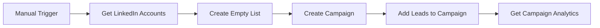
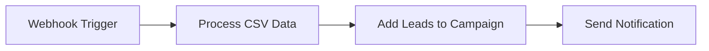
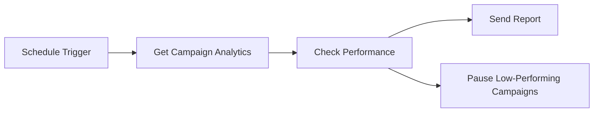

# HeyReach MCP Server - n8n Agent Setup Guide

## 🎯 **Overview**

The HeyReach MCP Server is fully compatible with n8n Agents using the community MCP node (`nerding-io/n8n-nodes-mcp`). This guide shows you how to set up LinkedIn automation workflows in n8n using HeyReach's 18 production-ready tools.

## 📦 **Prerequisites**

### 1. **HeyReach MCP Server**
```bash
# Already published and ready to use
npm install -g heyreach-mcp-server@1.2.0
```

### 2. **n8n Community MCP Node**
In your n8n instance:
1. Go to **Settings** → **Community Nodes**
2. Install: `n8n-nodes-mcp`
3. Restart n8n if required

### 3. **HeyReach API Key**
- Get your API key from HeyReach dashboard
- Format: Base64 encoded string (e.g., `QGUYbd7rkBqswN0otgk8KvzCVRZ+h7Tiz0onFETzF6M=`)

## 🔧 **n8n Agent Configuration**

### **Step 1: Create MCP Client Credentials**

In n8n, create new credentials:
- **Credential Type**: `MCP Client (STDIO)`
- **Configuration**:

```json
{
  "command": "npx",
  "args": [
    "heyreach-mcp-server@1.2.0",
    "--api-key=YOUR_HEYREACH_API_KEY_HERE"
  ],
  "transport": "stdio"
}
```

### **Step 2: Add MCP Client Node to Workflow**

1. Add **MCP Client** node to your n8n workflow
2. Select your HeyReach MCP credentials
3. Choose from 18 available tools:

## 🛠 **Available Tools (18 Total)**

### **Core Authentication & Campaign Management**
1. ✅ `check-api-key` - Validate HeyReach API authentication
2. ✅ `get-all-campaigns` - List all campaigns with pagination
3. ✅ `get-active-campaigns` - Filter campaigns ready for leads
4. ✅ `get-campaign-details` - Detailed campaign information
5. ✅ `toggle-campaign-status` - Legacy pause/resume (compatibility)

### **New Critical Tools (v1.2.0)**
6. 🆕 `get-linkedin-accounts` - **CRITICAL**: List LinkedIn sender accounts
7. 🆕 `create-campaign` - **CRITICAL**: Full campaign creation with sequences
8. 🆕 `pause-campaign` - Dedicated pause functionality
9. 🆕 `resume-campaign` - Dedicated resume functionality
10. 🆕 `remove-lead-from-campaign` - Lead removal capability
11. 🆕 `get-campaign-analytics` - Detailed performance metrics

### **Lead & List Management**
12. ✅ `add-leads-to-campaign` - Production-ready lead addition with validation
13. ✅ `get-lead-details` - Lead profile information
14. ✅ `get-all-lists` - Lead list management
15. ✅ `create-empty-list` - Create new lead lists

### **Communication & Analytics**
16. ✅ `get-conversations` - Inbox message management
17. ✅ `get-overall-stats` - Analytics and performance metrics
18. ✅ `get-my-network-for-sender` - Network profile access

## 🚀 **Example n8n Workflows**

### **Workflow 1: Complete Campaign Automation**



**Node Configuration**:

1. **Manual Trigger** → Start workflow
2. **MCP Client** → Tool: `get-linkedin-accounts`
3. **MCP Client** → Tool: `create-empty-list`
   ```json
   {
     "name": "Q1 Prospects {{ $now.format('YYYY-MM-DD') }}"
   }
   ```
4. **MCP Client** → Tool: `create-campaign`
   ```json
   {
     "name": "Q1 Outreach Campaign",
     "listId": "{{ $('Create Empty List').first().json.id }}",
     "linkedInAccountIds": ["{{ $('Get LinkedIn Accounts').first().json.accounts[0].id }}"],
     "sequence": {
       "steps": [
         {
           "type": "VIEW_PROFILE",
           "delay": 0
         },
         {
           "type": "CONNECTION_REQUEST",
           "delay": 1,
           "noteText": "Hi {{firstName}}, I'd love to connect!"
         },
         {
           "type": "MESSAGE",
           "delay": 3,
           "message": "Thanks for connecting, {{firstName}}! How's your experience with {{companyName}}?"
         }
       ]
     }
   }
   ```

### **Workflow 2: Lead Import & Management**



**Use Case**: Import leads from external systems (CRM, CSV uploads, etc.)

### **Workflow 3: Campaign Monitoring & Analytics**



**Use Case**: Automated campaign performance monitoring and optimization

## 🔒 **Security Best Practices**

### **API Key Management**
- ✅ **Store API key in n8n credentials** (encrypted)
- ✅ **Never hardcode API keys** in workflow nodes
- ✅ **Use environment variables** for sensitive data
- ✅ **Rotate API keys regularly**

### **Workflow Security**
- ✅ **Validate input data** before sending to HeyReach
- ✅ **Implement error handling** for API failures
- ✅ **Log important actions** for audit trails
- ✅ **Test workflows** in development environment first

## 🧪 **Testing Your Setup**

### **Quick Test Workflow**
1. Create new workflow in n8n
2. Add **Manual Trigger** node
3. Add **MCP Client** node with HeyReach credentials
4. Configure tool: `check-api-key`
5. Execute workflow
6. Verify response: `{"valid": true, "status": "API key is working correctly"}`

### **Expected Response**
```json
{
  "valid": true,
  "status": "API key is working correctly"
}
```

## 🔧 **Troubleshooting**

### **Common Issues**

#### **"Command not found" Error**
```bash
# Install HeyReach MCP Server globally
npm install -g heyreach-mcp-server@1.2.0
```

#### **"Invalid API key" Error**
- Verify API key format (base64 encoded)
- Check API key has proper permissions in HeyReach
- Test with `check-api-key` tool first

#### **"Tool not found" Error**
- Ensure n8n-nodes-mcp community node is installed
- Restart n8n after installing community nodes
- Verify MCP credentials are configured correctly

### **Debug Mode**
Enable debug logging in n8n:
```bash
# Set environment variable
N8N_LOG_LEVEL=debug
```

## 📚 **Additional Resources**

### **HeyReach MCP Server**
- **npm Package**: `heyreach-mcp-server@1.2.0`
- **GitHub**: https://github.com/bcharleson/heyreach-mcp
- **Documentation**: Comprehensive tool descriptions included

### **n8n Community MCP Node**
- **GitHub**: https://github.com/nerding-io/n8n-nodes-mcp
- **n8n Community**: https://community.n8n.io/

### **Model Context Protocol**
- **Official Docs**: https://modelcontextprotocol.io/
- **Specification**: https://modelcontextprotocol.io/specification/

---

## 🎉 **Ready to Automate!**

With HeyReach MCP Server + n8n Agents, you can now:
- ✅ **Automate complete LinkedIn campaigns** end-to-end
- ✅ **Integrate with any data source** n8n supports
- ✅ **Build complex workflows** with conditional logic
- ✅ **Monitor and optimize** campaign performance automatically
- ✅ **Scale LinkedIn outreach** without manual intervention

**Start building your LinkedIn automation workflows today!**
